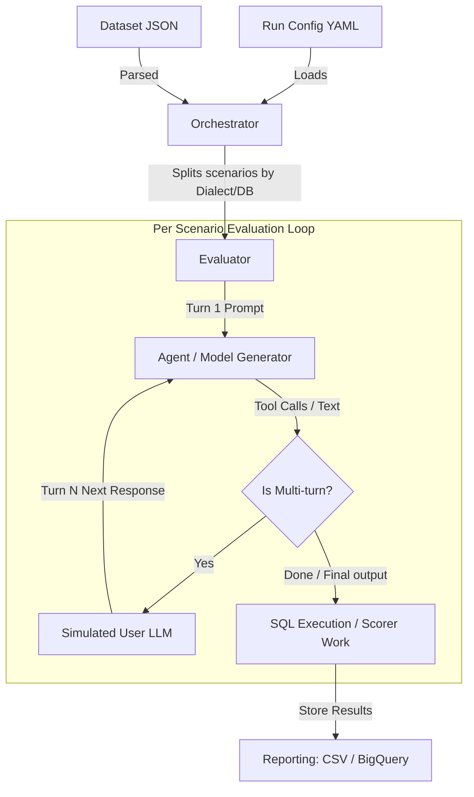
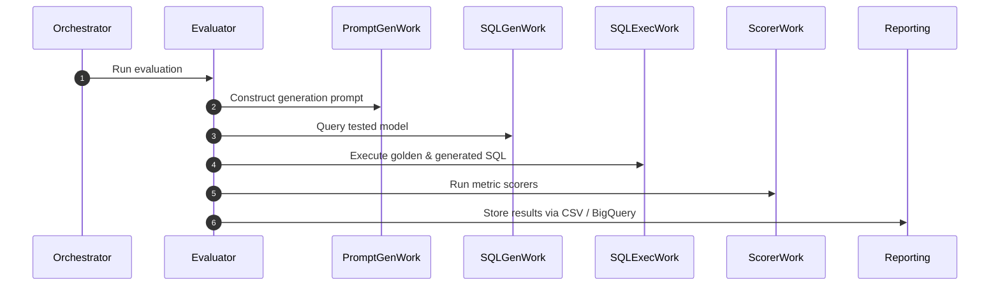
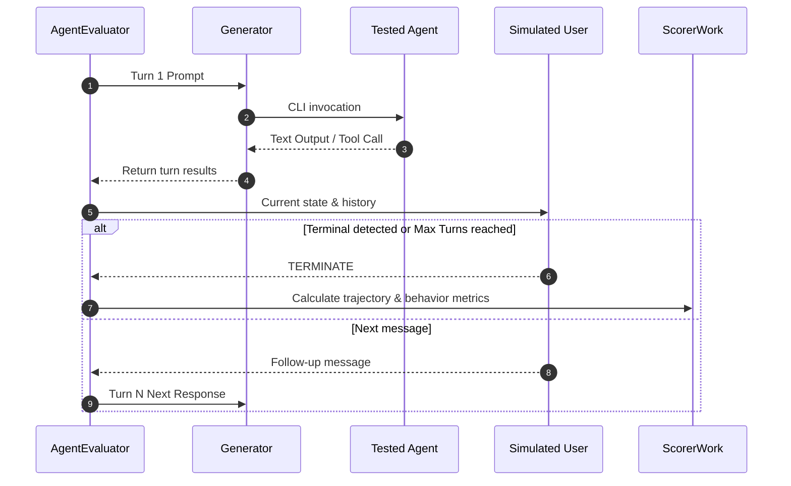

# EvalBench: Agentic Onboarding & Development Guide

Welcome to **EvalBench**! This guide is specifically designed for AI coding assistants and new developers to help you understand the repository's architecture, evaluation modes, codebase structure, and contribution flows.

---

## Table of Contents
- [Overview & Objectives](#overview--objectives)
- [Project Architecture](#project-architecture)
- [Module Directory Layout](#module-directory-layout)
- [Tool Paradigms & Generators](#tool-paradigms--generators)
- [Core Workflows & Lifecycle](#core-workflows--lifecycle)
- [Configuration Schemas](#configuration-schemas)
- [Local Development & Execution](#local-development--execution)
- [Troubleshooting & Tips](#troubleshooting--tips)

---

## Overview & Objectives

**EvalBench** is a highly flexible testing and evaluation framework designed to measure the quality of Generative AI (GenAI) workflows, specifically focusing on:
- **Database specific tasks**: Generating valid DDL, DML, and DQL across multiple database types (AlloyDB, BigQuery, Spanner, Postgres, SQLite, etc.).
- **Agent Multi-turn journeys**: Simulating complex user interactions where an LLM-based simulated user responds to the agent's questions or drives the conversation via a predetermined plan.
- **Extensible Scoring**: Evaluating outputs with a plug-and-play suite of deterministic and LLM-based scorers.

> [!NOTE]
> The core design principle of EvalBench is isolation. Each multi-turn execution runs in a sandboxed home directory (`.venv/fake_home/` or `.venv/fake_home_claude/`) to prevent local machine environment contamination.

---

## Project Architecture

EvalBench separates evaluation into distinct **orchestrators**, **evaluators**, **generators**, and **scorers**.



### Core Components
- **Orchestrators**: Manages dataset breakdown and parallel execution stages (`OneShotOrchestrator`, `InteractOrchestrator`, `AgentOrchestrator`, `DataAgentOrchestrator`).
- **Evaluators**: Executes the test scenario lifecycles for a given dialect or database (`Evaluator`, `InteractEvaluator`, `AgentEvaluator`, `DataAgentEvaluator`).
- **Generators**: Acts as the driver for the tested model or CLI (`GeminiCliGenerator`, `ClaudeCodeGenerator`, `QueryData`).
- **Simulated Users**: Drives conversations autonomously by translating conversation plans into user messages.
- **Scorers**: Computes correctness metrics (Exact Match, LLM-Rater, Trajectory Matcher, Behavioral Metrics).

---

## Module Directory Layout

```
evalbench/
├── client/           # API clients for EvalBench services
├── databases/        # Database drivers & connection pooling logic
│   ├── alloydb.py
│   ├── bigquery.py
│   ├── spanner.py
│   └── sqlite.py
├── dataset/          # Dataset format parsers & loading logic
│   ├── dataset.py
│   ├── evalinput.py
│   └── evalgeminicliinput.py
├── evalproto/        # Protobuf definitions for gRPC evaluation service
├── evaluator/        # The core execution engines
│   ├── agentevaluator.py        # Gemini CLI / Claude Code multi-turn evaluator
│   ├── agentorchestrator.py     # Multi-turn Agent orchestrator
│   ├── evaluator.py             # Base single-turn (oneshot) evaluator
│   └── oneshotorchestrator.py   # Base oneshot orchestrator
├── generators/       # Tested system adapters
│   ├── models/
│   │   ├── claude_code.py  # Claude Code driver
│   │   └── gemini_cli.py   # Gemini CLI driver
│   └── prompts/
├── mp/               # Multi-processing / multi-threading runners
│   └── mprunner.py
├── reporting/        # Output formatting and report generation
│   ├── bqstore.py
│   └── csv.py
├── scorers/          # Correctness and efficiency metrics
│   ├── exactmatcher.py
│   ├── goalcompletionrate.py
│   ├── llmrater.py
│   └── trajectorymatcher.py
├── util/             # Helper functions (Config, Rate Limits, CLI Fakes)
└── work/             # Concurrency work items (SQLGenWork, ScorerWork)
```

---

## Tool Paradigms & Generators

When evaluating agentic frameworks that leverage external tools (e.g., Gemini CLI, Claude Code), EvalBench translates and tests three primary tool paradigms:

| Paradigm | Supported Generators | How it Works |
|---|---|---|
| **MCP Servers** | `gemini_cli`, `claude_code` | Remote HTTP/SSE or local stdio-based Model Context Protocol servers |
| **Extensions** | `gemini_cli` | GitHub-hosted plugin packages installed idempotently via CLI |
| **Skills** | `gemini_cli` | Local or registry skill packages enabled/linked in the sandboxed environment |

---

## Core Workflows & Lifecycle

### 1. OneShot SQL Generation Workflow
Evaluates direct NL2SQL generation capability without multi-turn dialog.


### 2. Multi-Turn Agent Scenario Workflow
Evaluates iterative workflows where a simulated user drives the agent through a scenario plan.


---

## Configuration Schemas

To run an evaluation, you need three main configurations.

### 1. Run Configuration (e.g., `run_config.yaml`)
Defines the top-level parameters for the evaluation.

```yaml
dataset_config: datasets/gemini-cli-tools/gemini-cli.evalset.json
dataset_format: gemini-cli-format

orchestrator: geminicli
model_config: datasets/model_configs/gemini_cli_model.yaml
simulated_user_model_config: datasets/model_configs/gemini_2.5_pro_model.yaml

runners:
  agent_runners: 10

scorers:
  trajectory_matcher: {}
  goal_completion:
    model_config: datasets/model_configs/gemini_2.5_pro_model.yaml
  behavioral_metrics:
    model_config: datasets/model_configs/gemini_2.5_pro_model.yaml
  turn_count: {}

reporting:
  csv:
    output_directory: 'results'
  bigquery:
    gcp_project_id: 'your-gcp-project-id'
```

### 2. Model Configuration (e.g., `gemini_cli_model.yaml`)
Specifies tested version, model ID, and environment variables.

```yaml
gemini_cli_version: "@google/gemini-cli@0.36.0"
generator: gemini_cli
env:
  GOOGLE_CLOUD_PROJECT: "my-evaluation-project"
  GOOGLE_CLOUD_LOCATION: "us-central1"
  GOOGLE_GENAI_USE_VERTEXAI: "true"
setup:
  mcp_servers:
    "cloud-sql":
      httpUrl: "https://sqladmin.googleapis.com/mcp"
      authProviderType: google_credentials
```

### 3. Dataset Scenario Config (e.g., `evalset.json`)
Contains the test cases.

```json
{
  "scenarios": [
    {
      "id": "list-instances-01",
      "starting_prompt": "List all Cloud SQL instances in project my-evaluation-project",
      "conversation_plan": "Ensure the agent accurately calls list_instances. Verify the output is returned correctly.",
      "expected_trajectory": ["list_instances"],
      "env": { "GOOGLE_CLOUD_PROJECT": "my-evaluation-project" },
      "max_turns": 4
    }
  ]
}
```

### 4. BigQuery Reporting (Centralized Metrics)
To upload metrics directly to Google BigQuery and create Looker Studio dashboard links, configure the `bigquery` key in your `reporting` section:

```yaml
reporting:
  bigquery:
    gcp_project_id: 'your-gcp-project-id'
    dataset_location: 'US' # Optional, defaults to 'US'
```

---

## Local Development & Execution

### Setup Python Virtual Environment

```bash
python3 -m venv venv
source venv/bin/activate
pip install -r requirements.txt
```

### GCP Authentication
Ensure credentials are set up for Vertex AI calls:

```bash
gcloud auth application-default login
export EVAL_GCP_PROJECT_ID=your_project_id
export EVAL_GCP_PROJECT_REGION=us-central1
```

### Running EvalBench
Set the configuration path and trigger execution:

```bash
export EVAL_CONFIG=datasets/bat/example_run_config.yaml
./evalbench/run.sh
```

---

## Troubleshooting & Tips

### Benign Warnings
During testing, you may see schema validation errors in stdout like:
```
unknown format "google-duration" ignored
```
> [!TIP]
> These are harmless JSON schema warnings that occur due to differences in draft support and can be safely ignored.

### Cleaning Isolation Sandbox
If settings from a previous run conflict or cause issues, clear out the generator sandboxes:
```bash
rm -rf .venv/fake_home
rm -rf .venv/fake_home_claude
```

### Forcing Sequential Runs
By default, scenario runs happen concurrently (up to 10 in parallel). To test your changes or debug execution step-by-step, restrict the concurrency to 1:
```yaml
runners:
  agent_runners: 1
```
